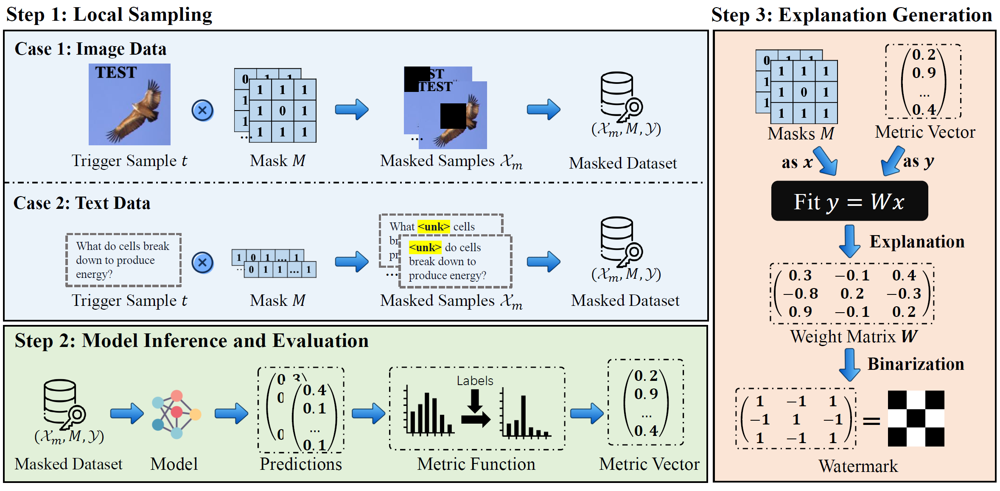

<!--  -->

## 🪪About Me

I'm Shuo Shao😄, a third-year Ph.D. student with the College of Computer Science and Technology and the State Key Laboratory of Blockchain and Data Security, Zhejiang University. I am currently advised by Prof. <a href="https://scholar.google.com/citations?user=5fa4lOQAAAAJ">Zhan Qin</a> and Prof. <a href="https://scholar.google.com/citations?user=uuQA_rcAAAAJ">Kui Ren</a>. I also work closely with Dr. <a href="https://scholar.google.com/citations?user=mSW7kU8AAAAJ">Yiming Li</a> and Prof. <a href="https://scholar.google.com/citations?user=bdFQARIAAAAJ">Wenyuan Yang</a>. I received my B.Eng. degree in Computer Science and Technology from Central South University in 2022, advised by Prof. <a href="https://scholar.google.com/citations?user=3odvjZ0AAAAJ">Xiyao Liu</a>.

My research interests include:

- Copyright protection in AI (model, dataset, and generated content).
- Backdoor attack and defense.
- Federated learning.
- AI security and privacy.

---

## 🔥News

- **[2024.11]**: Our SoK paper about AIGC watermarking is available on arXiv. We welcome any discussions and opportunities for collaboration!
- **[2024.10]**: 🎉Our paper about point cloud dataset ownership verification is accepted by TIFS.
- **[2024.8]**: 🎉Our paper about LLM watermarking, entitled "Explanation as a Watermark: Towards Harmless and Multi-bit Model Ownership Verification via Watermarking Feature Attribution", is accepted by NDSS 2025!
- **[2024.4]**: 🎉Our paper "FedTracker: Furnishing Ownership Verification and Traceability for Federated Learning Model" is accepted by TDSC.
- **[2023.11]**: 🎉Our paper "Watermarking in Secure Federated Learning: A Verification Framework Based on Client-Side Backdooring" is accepted by TIST.

---

## 📖Selected Publications

<!--  -->

  <!-- 左边的图 -->
  

    
    <!-- 会议或期刊标记 -->
    

      NDSS 2025
    

  

  
  <!-- 右边的文字 -->
  

    <h3>论文标题</h3>
    
<strong>作者:</strong> 你的名字

    
<strong>摘要:</strong> 论文摘要内容...

  

---

## ✉️Contact

If you have any questions about my works, please feel free to contact me.

- **Email:** shaoshuo_ss@zju.edu.cn; shaoshuo2000@gmail.com
