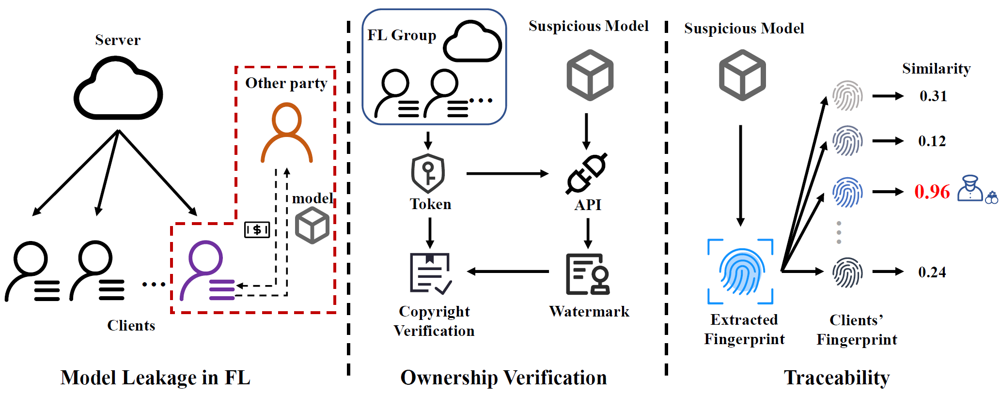

<head>
    <link rel="stylesheet" type="text/css" href="assets/style.css">
</head>

<!--  -->
<!-- 

 -->

## 🪪About Me

I'm Shuo Shao😄, a third-year Ph.D. student with the College of Computer Science and Technology and the State Key Laboratory of Blockchain and Data Security, Zhejiang University. I am currently advised by Prof. <a href="https://scholar.google.com/citations?user=5fa4lOQAAAAJ">Zhan Qin</a> and Prof. <a href="https://scholar.google.com/citations?user=uuQA_rcAAAAJ">Kui Ren</a>. I also work closely with Dr. <a href="https://scholar.google.com/citations?user=mSW7kU8AAAAJ">Yiming Li</a> and Prof. <a href="https://scholar.google.com/citations?user=bdFQARIAAAAJ">Wenyuan Yang</a>. I received my B.Eng. degree in Computer Science and Technology from Central South University in 2022, advised by Prof. <a href="https://scholar.google.com/citations?user=3odvjZ0AAAAJ">Xiyao Liu</a>.

My research interests focus on three main aspects of trustworthy AI: copyright, security, and privacy, including

- **AI Copyright Protection**
  - Model Watermarking and Fingerprinting
  - Model Authorization and Access Control
  - Dataset Auditing
- **AI Security**
  - Backdoor Attack and Defense
  - LLM Security
- **AI Privacy**
  - Membership Inference and Data Extraction
  - Privacy-preserving Model Inference

---

## 🔥News

- **[2024.10]**: 🎉Our paper about point cloud dataset ownership verification is accepted by TIFS.
- **[2024.8]**: 🎉Our paper about LLM watermarking, entitled "Explanation as a Watermark: Towards Harmless and Multi-bit Model Ownership Verification via Watermarking Feature Attribution", is accepted by NDSS 2025!
- **[2024.4]**: 🎉Our paper "FedTracker: Furnishing Ownership Verification and Traceability for Federated Learning Model" is accepted by TDSC.
- **[2023.11]**: 🎉Our paper "Watermarking in Secure Federated Learning: A Verification Framework Based on Client-Side Backdooring" is accepted by TIST.

---

## 📖Selected Publications

---

  <!-- 左边的图 -->
  

    
    <!-- 会议或期刊标记 -->
    
NDSS 2025

  

  
  <!-- 右边的文字 -->
  

    
<a href="https://arxiv.org/abs/2405.04825"><b>Explanation as a Watermark: Towards Harmless and Multi-bit Model Ownership Verification via Watermarking Feature Attribution</b></a>

    
<b>Shuo Shao</b>, Yiming Li, Hongwei Yao, Yiling He, Zhan Qin, Kui Ren.

    <ul>
        <li>We propose a novel black-box model watermarking paradigm based on XAI.</li>
        <li>Our paradigm is harmless and can facilitate multi-bit watermark embedding.</li>
    </ul>
  

---

  <!-- 左边的图 -->
  

    
    <!-- 会议或期刊标记 -->
    
TDSC 2024

  

  
  <!-- 右边的文字 -->
  

    
<a href="https://ieeexplore.ieee.org/document/10504977"><b>FedTracker: Furnishing Ownership Verification and Traceability for Federated Learning Model</b></a>

    
<b>Shuo Shao</b>, Wenyuan Yang, Hanlin Gu, Zhan Qin, Lixin Fan, Qiang Yang, Kui Ren.

    <ul>
        <li>We start the first study about the ownership traceability of FL models.</li>
        <li>We propose a continual-learning-based watermark embedding method.</li>
    </ul>
  

---

## ✉️Contact

If you have any questions about my works, please feel free to contact me.

- **Email:** shaoshuo_ss@zju.edu.cn; shaoshuo2000@gmail.com
